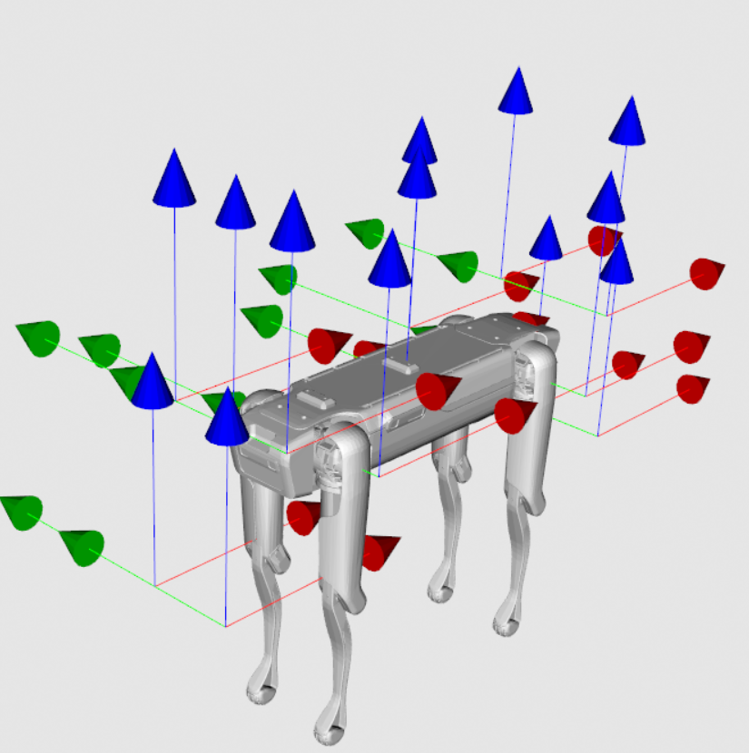
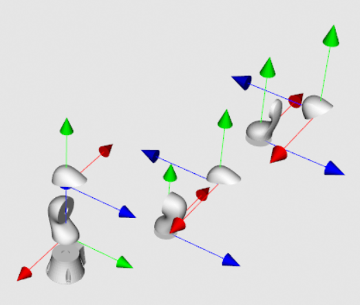
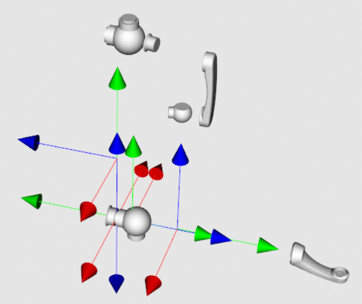

<!-- omit in toc -->
TinyURDF
========

[](https://github.com/wissem01chiha/tinyurdf/actions/workflows/cmake-build.yml)
[](https://github.com/wissem01chiha/tinyurdf/actions/workflows/build-docs.yml)
[](https://github.com/wissem01chiha/tinyurdf/actions/workflows/cpp-lint.yml)


<div style="display: flex; justify-content: center; align-items: center; gap: 10px;">
  
  
  
</div>

TinyURDF is a modern, fast, cross-platform c++17 library for parsing and visualizing [URDF](https://wiki.ros.org/urdf/Tutorials) model files. It is designed to handle custom multibody configurations that existing tools do not support, including parallel multibodies or graph-like structures, it has no external dependencies and provides a stable and simple API for loading, visualizing, and verifying multijoint models.

<!-- omit in toc -->
Table of Contents
-----------------
- [⚡ Prerequisites](#-prerequisites)
- [📚 Documentation](#-documentation)
- [📦 Dependencies](#-dependencies)
- [💻 Build](#-build)
- [🛠️ Examples](#️-examples)
- [🚀 Releases](#-releases)
- [Related Projects](#related-projects)
- [🤝 Contribution](#-contribution)
- [📜 License](#-license)
- [🎓Citing](#citing)

## ⚡ Prerequisites

1. C++17 compatible compiler (GCC 7.1+, Clang 5.0+, MSVC 2017+)
2. CMake (version 3.14+)
3. VTK (optional, required only for building the visualization engine)

## 📚 Documentation

official documentation can be found [here](https://wissem01chiha.github.io/tinyurdf/).


## 📦 Dependencies

TinyURDF currently depends on the following libraries:
- [TinyXML2](https://github.com/leethomason/tinyxml2)
- [loguru](https://github.com/emilk/loguru)
- [Eigen3](https://eigen.tuxfamily.org)
- [cxxopts](https://github.com/jarro2783/cxxopts)

These dependencies are automatically fetched and compiled during the build process.  
Building the rendering interface requires additional third-party software, such as **[VTK](https://vtk.org/)**, which must be built separately. See the [INSTALL](INSTALL.md) file for more information.


## 💻 Build  

The library has been successfully built and tested on the following platforms with the corresponding dependencies:

#### Windows <!-- omit from toc -->
1. Compiler: MSVC 2017, CMake: 3.22.1
2. VTK: 9.3.1, Eigen: 3.4.0
#### Linux <!-- omit from toc -->
1. Compiler: GCC 8, CMake: Latest
2. VTK: 9.3.1, Eigen: 3.4.0

Other platforms or compilers have not yet been tested. Please open an issue on [GitHub Issues](https://github.com/wissem01chiha/tinyurdf/issues) for any suspected bugs,
we recommend using **Ninja** with Microsoft Visual Studio for faster builds.  

Install Ninja  

- **On Windows** (via Chocolatey):  
  ```bash
  choco install ninja
  ```
- **On linux**
  ```bash
  sudo apt-get install ninja-build
  ```
#### Building the Project <!-- omit from toc -->

run the following commands to build the project:

```bash
mkdir build && cd build
cmake -G Ninja  ..
ninja
ninja install 
```
By default, this will use the MSVC compiler on Windows and the default CMake options. To use a different compiler with Ninja, run:


```bash
cmake -G Ninja -DCMAKE_CXX_COMPILER=g++ -DCMAKE_C_COMPILER=gcc ..
make 
make install 
```
#### for Unix-based Systems or MinGW on Windows <!-- omit from toc -->
If you prefer not to use Ninja, you can build the project using Unix Makefiles:  
```bash
mkdir build && cd build
cmake -G "Unix Makefiles" ..
make
make install 
```
These commands will build and install the static/shared library under the `lib/` directory and the include files in the `include/` directory of the build folder.  

> [!NOTE]  
> This build method is typically slower than the Ninja-based build.
#### Build Configuration Options <!-- omit from toc -->
You can customize the build using the following CMake options:
```bash
cmake -G Ninja \
      -DBUILD_TESTS=FALSE \       # Build tests 
      -DBUILD_PYTHON3=FALSE \     # Enable Python 3 bindings
      -DUSE_VTK=TRUE \            # Use VTK as the default renderer 
      -DBUILD_SCRIPTS=TRUE \      # Build cpp scripts 
      -DBUILD_DOCS=FALSE          # Build documentation with Doxygen  
      -DBUILD_SHARED_LIBS = FALSE # build shared librarry 

```
> [!NOTE]  
> For Python bindings build and installation, enable the `-DBUILD_PYTHON3` flag, and run the following command from the root of the project:  
> ```bash  
> pip install --user .  
> ```  
> Note that Python bindings are not currently tested, many bugs exist. Use them at your own risk, or feel free to contribute

TinyURDF will soon be available for installation via **vcpkg**, **Conan**, and **CMake FetchContent**.  

  
## 🛠️ Examples  
 

The available documentation does not provide extensive examples. 
- Demo example scripts are implemented in the [examples](/examples/src/) folder.  
- Additional test scripts, which may be useful, can be found in the [test](/test/) folder.  
- samples of models files can be found in the [urdf](examples/urdf/) directory, these files are mainly get from [urdf_files_dataset](https://github.com/Daniella1/urdf_files_dataset).

The examples assume that all installation instructions are followed, and the library is successfully installed.  

#### Example 1: parsing an urdf file  <!-- omit from toc -->

```cpp
#include "tinyurdf/tinyurdf.h"  

int main() {
  // create the  parser
  URDFParser parser;  
  // parse the file
  parser.parse("path/to/tinyurdf/examples/urdf/example.urdf");  
  // get the model 
  std::shared_ptr<Model> model_ = parser.get(); 
  // print the model info  
  model_->print(std::cout);
  return 0;
}
```
This will print all model data to the standard output without any formatting or adjustments.

Alternatively, when `-DBUILD_SCRIPTS` is enabled, we can parse the files from the command line as shown below:

```bash
./parse --file path/to/your/urdf_model.urdf
```

#### Example 2: get a multijoint model data <!-- omit from toc -->

```cpp
#include "tinyurdf/tinyurdf.h"  

int main() {
  // construct the parser 
  URDFParser parser; 
  // call parsing routine 
  parser.parse("path/to/tinyurdf/examples/urdf/example.urdf");
  /// get the model 
  std::shared_ptr<Model> model_ = parser.get();  
  /// get the model name 
  std::string name = model_->getName(); 
  // get model joints
  std::vector<std::shared_ptr<Joint>> joints_ = model_->getJoints();
  // get model links 
  std::vector<std::shared_ptr<Link>> links_ = model_->getLinks();
  // check whether the model is empty 
  bool status = model_->empty();
  return 0;
}
```
#### Example 4: rendering a multijoint model <!-- omit from toc -->


```cpp
#include "tinyurdf/tinyurdf.h"

int main() {
  // create the parser
  URDFParser parser;
  const char* file_path = "path/to/tinyurdf/examples/urdf/example.urdf";
  // parse the file
  parser.parse(file_path);
  // create the renderer
  URDFRenderer render;
  // set the model for rendering
  render.setModel(*(parser.get())); 
  // set background color
  render.setBackground(0.9, 0.9, 0.9, 1.0);  
  // disable label text
  render.setLabelText(false);
  // show the rendered model                
  render.show();                              
  return 0;
}
```

alternatively, we can render the model with customization options using the built render script:
```bash
./render --file path/to/your/urdf_model.urdf --red 0.5 --green 0.5 --blue 0.7 --labels true
```

## 🚀 Releases

- **libtinyurdf-1.0.0** (september 2024): first release.

## Related Projects

- [urdf-vis](https://github.com/openrr/urdf-viz) 
- [urdf-importer](https://github.com/Unity-Technologies/URDF-Importer)

## 🤝 Contribution  

the project is actively in progress, and contributions are welcome. 
see the [CONTRIBUTING](CONTRIBUTING.md) file for more information.  currently, there are no issue or pull request templates,feel free to open issues or submit pull requests with your ideas and fixes.  

## 📜 License  
  
See the [LICENSE](./LICENSE) file.  

## 🎓Citing
 

If you use this repository in your project, please cite it as follows:

```bibtex
@software{tinyurdf,
  author = {wissem chiha},
  title = {TinyURDF},
  year = {2024}
}
```
[Back to top](#top)
